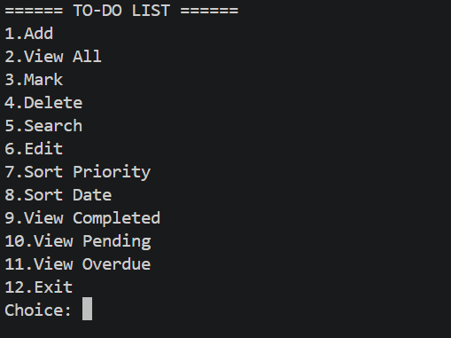
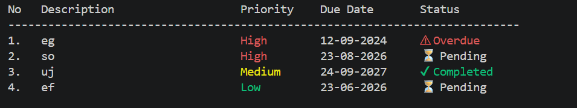
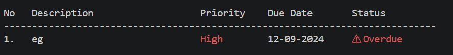

# 📝 To-Do List Manager (C++)

A feature-rich **console-based To-Do List Manager** built in **C++** that allows users to efficiently manage daily tasks with priority levels, due dates, filtering, and persistent storage.

---

## 🚀 Features

- ➕ Add new tasks
- 📋 View tasks in clean table format
- ✔ Mark tasks as completed
- ❌ Delete tasks (with confirmation)
- ✏ Edit existing tasks
- 🔍 Search tasks by keyword
- 🎯 Priority levels (High / Medium / Low)
- 📅 Due date with validation (DD-MM-YYYY)
- ⚠ Automatic overdue detection
- 🔃 Sorting (by priority & date)
- 🧠 Smart filtering:
  - All tasks
  - Completed
  - Pending
  - Overdue
- 💾 File persistence using `tasks.txt`

---

## 🖥️ Screenshots

### 📌 Main Menu


### 📊 Task View


### ⚠ Overdue Tasks


---

## 🛠️ Tech Stack

- **Language:** C++
- **Concepts Used:**
  - STL (`vector`, `algorithm`)
  - File handling
  - Sorting & searching
  - Input validation
  - Modular programming

---

## ▶️ How to Run

```bash
g++ todo.cpp -o todo
./todo
📂 Project Structure
CODSOFT_To_Do_App/
│── todo.cpp
│── README.md
│── .gitignore
│── screenshots/
📌 Future Improvements
GUI version (Qt / ImGui)
Task categories / tags
Notifications / reminders
Export to CSV / JSON
⭐ Author

Susovan Hati

📜 License

This project is licensed under the MIT License.


---
